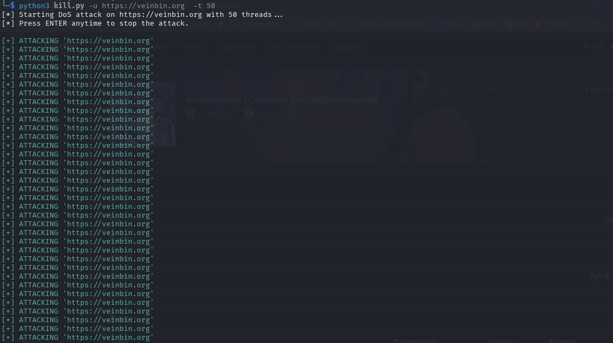

# Kill.sh
> Kill.sh is an Denial-of-Service tool that works on websites/webservers that uses HTTP or HTTPS requests
> ⚠️ **use this tool at your own risk** ⚠️
> is it recomendable to use an virtual private network or an proxychain while using this Kill.sh, this tool is an DoS tool that means your using your direct device IP Address to make the attacks that means your ip will be logged into the site/web server.
# INSTALATION
```bash
git clone https://github.com/btc-dos/kill.sh
```

```bash
cd kill.sh
```

```bash
python3 -m venv venv
```

```bash
source venv/bin/activate
```

```bash
pip install -r requirements.txt
```


```bash
python3 kill.py -h
```

               

